# Retinal-vessel-segmentation-and-vessel-diameter-estimation
The following program employes a global thresholding based segmentation algorithm for retinal vessel segmentation and a clustering based symmetry exploiting algorithm for the estimation of retinal vessel diameters.
## Dependencies
You can install Python dependencies using pip install -r [requirements.txt](requirements.txt), and it should work. If you want to install the packages manually, here's a list:
1. [Numpy](https://github.com/numpy/numpy/blob/master/INSTALL.rst.txt)
2. [Opencv](https://opencv.org/) (4.2.0.34)
3. [Opencv-contrib-python](https://pypi.org/project/opencv-contrib-python/) (4.2.0.34)
## Description
Following flowcharts explain the algorithms used for segmentation and diameter estimation:

Retinal vessel segmentation                                                             |  Diameter estimation
:--------------------------------------------------------------------------------------:|:-----------------------------------------------------------------------------------------:
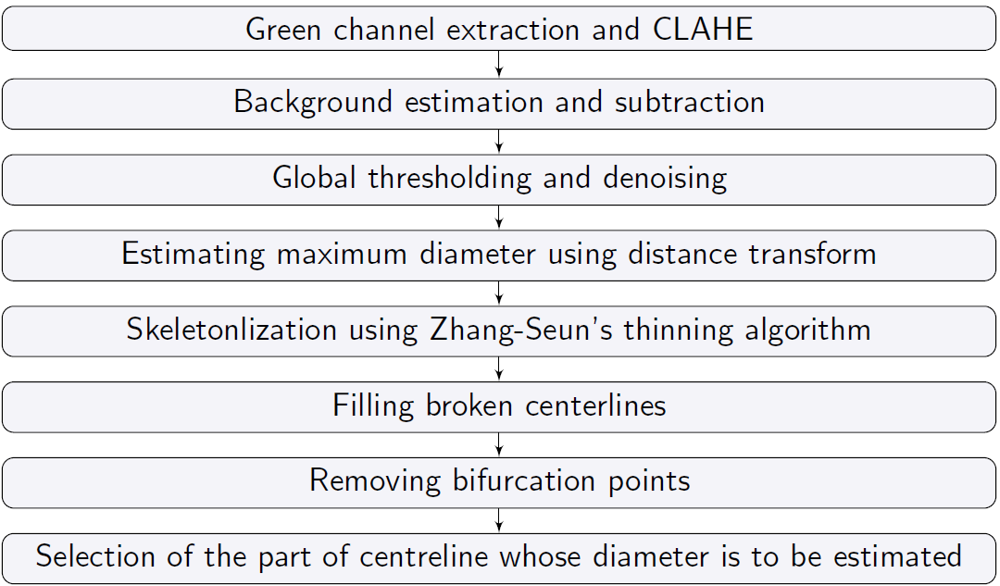                                         |  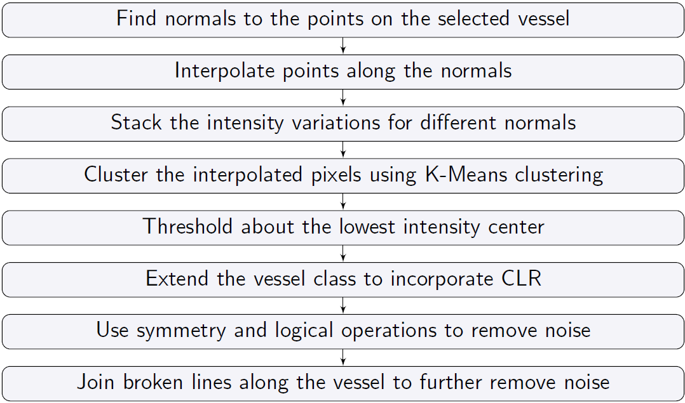

## How to use
As an input, pass the path of the retinal image, to [main.py](main.py). The image will be segmented and a vessel centreline map will pop in a new window. Select the target vessel centerline by clicking near it and press *Q* to close the window. As an input, pass an integer corresponding to the number of equal parts in which you want to divide the selected centreline. All the parts of the selected centreline will pop in a new window. Again, select the target part by clicking near it and press *Q* to close the window. Diameters of the target centreline part will be passed out as an output along with an annotated image with predicted diameters.

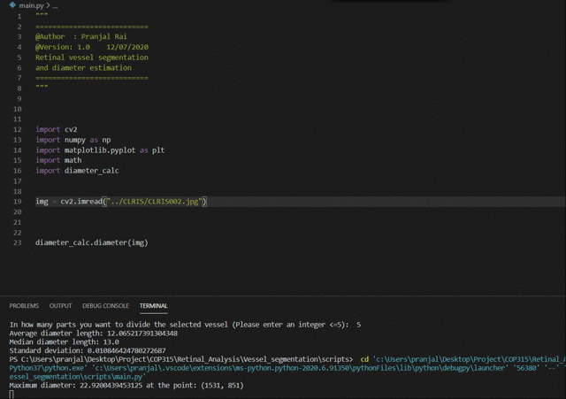

## Results
Following are the results for an image taken from the [REVIEW](http://www.aldiri.info/Image%20Datasets/Review.aspx) dataset:

Input image                                         |  Segmented image                                      |   Centreline map  
:--------------------------------------------------:|:-----------------------------------------------------:|:------------------------------------------------------------:
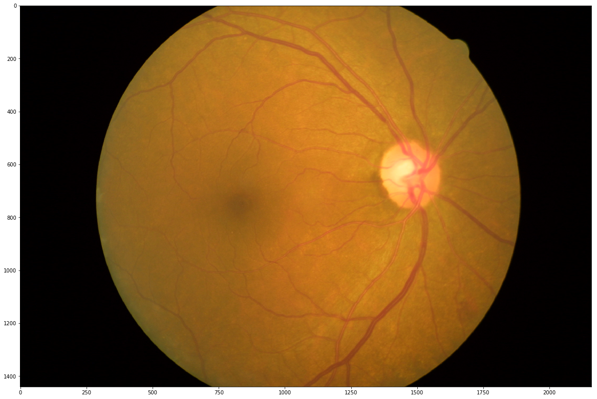            |  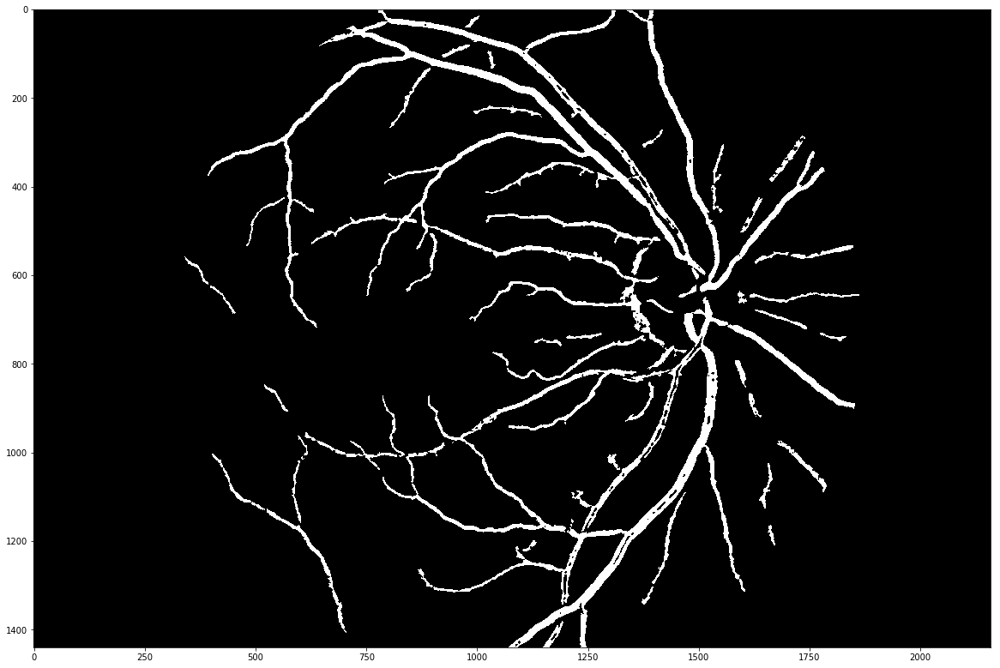     |   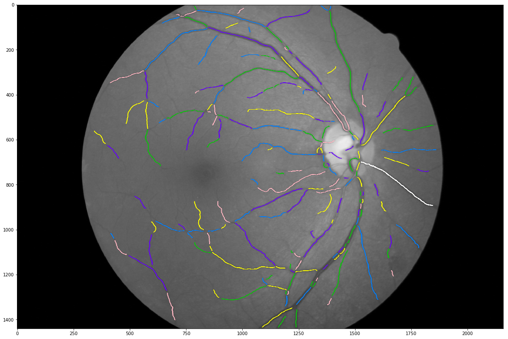 

Interpolation normal to the centreline              |  Stacked intensity variations along the normal        |   Clustered variations  
:--------------------------------------------------:|:-----------------------------------------------------:|:------------------------------------------------------------:
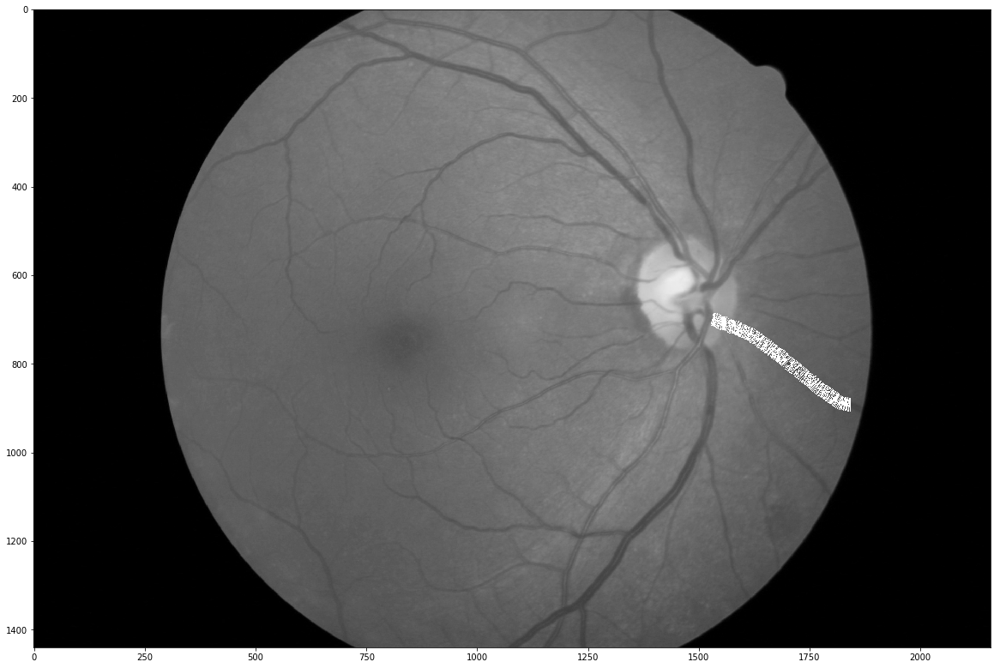    |  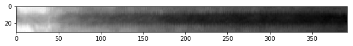 |   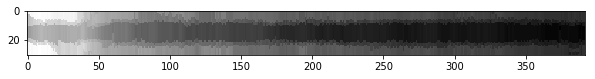 

The novel symmetry exploitation after clustering makes the algorithm robust as shown below:

Diameters from clustered vaiations (REVIEW)                                             |  Diameters from clustered variations (Ophtlamoscopic)
:--------------------------------------------------------------------------------------:|:-----------------------------------------------------------------------------------------:
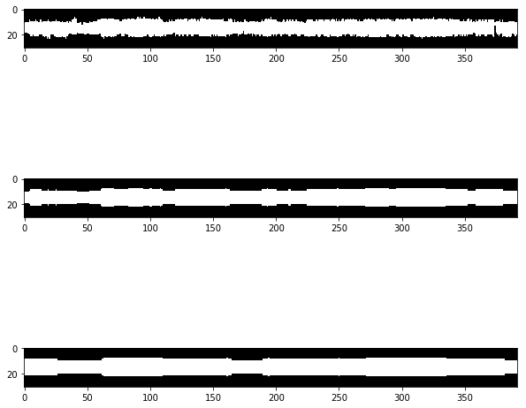                                             |  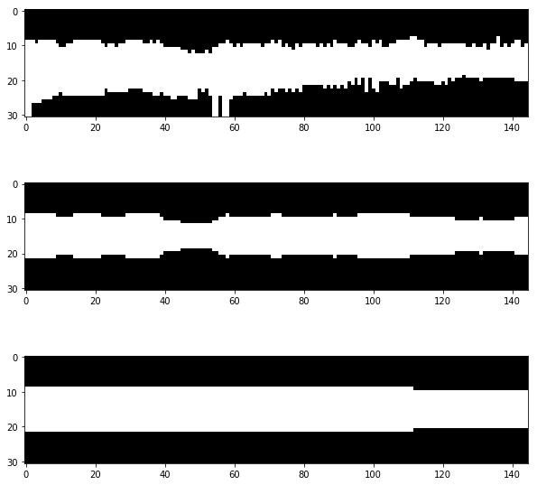

## Detailed Report
Detailed report can be found [here](https://arxiv.org/abs/2009.11099) as a Perprint.
## References

**[1]** Dinesh Kant Kumar, Behzad Aliahmad, Hao Hao, Mohd Zulfaezal
Che Azemin and Ryo Kawasaki, **A Method for Visualization of Fine
Retinal Vascular Pulsation Using Nonmydriatic Fundus Camera
Synchronized with Electrocardiogram**, *ISRN Ophthalmology*, 2013

**[2]** Teresa Araujo, Ana Maria Mendonca and Aurelio Campilho,
**Parametric model ftting-based approach for retinal blood vessel
caliber estimation in eye fundus images**, *Plos One*, 2018

**[3]** Et al. Samiksha Pachade, **Retinal vasculature segmentation and
measurement framework for color fundus and SLO images**,
*Biocybernetics and Biomedical Engineering*, 2020

**[4]** Et al. Bashir Al-Diri, **REVIEW - A Reference Data Set for
Retinal Vessel Profiles**, 2008

## License
The program is licensed under MIT License. See [LICENSE](LICENSE) for more details.

